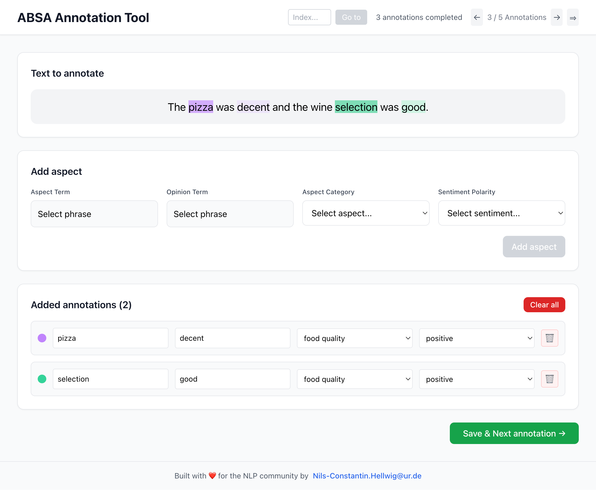

# 🎯 ABSA Annotation Tool

> *A modern, intuitive web interface for Aspect-Based Sentiment Analysis annotation*

[](https://reactjs.org/)
[](https://typescriptlang.org/)
[](https://vitejs.dev/)
[](https://tailwindcss.com/)
[](https://fastapi.tiangolo.com/)
[](https://python.org)

## 📖 What is this?

This tool helps you **annotate text data for Aspect-Based Sentiment Analysis (ABSA)** through a modern web interface built with **React**, **TypeScript**, and **Vite**. You can select text phrases by clicking, assign sentiment labels (positive, negative, neutral) to specific aspects, and categorize them into predefined or custom categories. The tool supports configuring any number of sentiment elements - choose from the standard aspect_term, aspect_category, sentiment_polarity, and opinion_term, or define your own elements. It handles both **CSV files** (UTF-8 encoded with `text,label,translation` structure) and **JSON files** (flexible object structure), supports multilingual data with optional translation display, and provides progress tracking through navigation, session IDs, and real-time annotation status.



## ✨ Features

- **Modern TypeScript Frontend** - Built with React, TypeScript, and Vite for fast development and type safety
- **Dark Mode Support** - Toggle between light and dark themes with persistent localStorage settings
- **Intuitive UI** - Clean, modern interface for efficient annotation with smooth transitions
- **Smart Phrase Selection** - Click-to-select text spans with visual feedback
- **Visual Phrase Highlighting** - Annotated phrases are highlighted directly in the text with unique colors
- **Color-Coded Annotations** - Each annotation gets a unique color with visual indicators in the annotation list
- **Intelligent Color Mixing** - Overlapping phrases show mixed colors to visualize annotation overlaps
- **Automatic Phrase Cleaning** - Removes punctuation from start/end of selected phrases (configurable)
- **Click-on-Token Selection** - Smart token-based text selection that snaps to word boundaries (configurable)
- **Combined Annotation Popup** - When both aspect and opinion terms are configured, annotate both in a single, unified dialog
- **Separate Text Selection** - Independent phrase selection for aspect terms and opinion terms
- **Progress Tracking** - Real-time annotation progress and navigation
- **Flexible Configuration** - Customizable sentiment elements and categories
- **Translation Support** - Optional translations displayed below original text
- **Session Management** - Optional session IDs for tracking annotation sessions
- **CLI Tool** - Command-line configuration for different domains

## 🎨 Visual Features

### Dark Mode
- **Theme Toggle** - Switch between light and dark modes with a single click
- **Persistent Settings** - Theme preference saved in browser localStorage
- **System Preference** - Automatically detects and respects system dark mode setting
- **Smooth Transitions** - Elegant transitions between light and dark themes
- **Complete Coverage** - All UI elements optimized for both themes

### Phrase Highlighting
- **Color-coded text**: Each annotation gets its own unique color in the text
- **Overlap visualization**: When phrases overlap, colors mix to show intersections
- **Clear distinction**: Aspect terms appear stronger, opinion terms more subtle

### Clean Interface  
- **Colored indicators**: Each annotation shows a matching colored circle
- **No label clutter**: Clean list without "AT:", "OT:" prefixes
- **25 vibrant colors**: Purple, Emerald, Orange, Pink, Cyan, and more
- **Color cycling**: After 25 annotations, colors repeat from the beginning

---

## 🚀 Quick Start

### Option 1: One-Command Launch (Recommended)

```bash
# Install Python dependencies
pip install fastapi uvicorn pandas

# Install frontend dependencies  
cd frontend && npm install && cd ..

# Start with example CSV file (UTF-8 encoded)
./absa-annotator examples/restaurant_reviews.csv

# Start with example JSON file
./absa-annotator examples/restaurant_reviews.json

# Or use the example configuration
./absa-annotator examples/restaurant_reviews.json --load-config examples/example_config.json
```

### Option 2: Manual Setup

#### Backend Setup

```bash
# Install dependencies
pip install fastapi uvicorn pandas

# Start the server
uvicorn main:app --reload --port 8000
```

#### Frontend Setup

```bash
# Navigate to frontend directory
cd frontend

# Install dependencies
npm install

# Start development server (Vite)
npm run dev
```

The app will open at `http://localhost:3000`

---

## 🛠️ CLI Configuration

The `absa-annotator` CLI tool configures and runs your annotation environment:

```bash
# Basic usage - starts frontend and backend by default
./absa-annotator examples/restaurant_reviews.csv
./absa-annotator examples/restaurant_reviews.json

# Load configuration from file
./absa-annotator examples/restaurant_reviews.json --load-config examples/example_config.json

# Start only backend server
./absa-annotator examples/restaurant_reviews.csv --backend

# Custom ports and session
./absa-annotator examples/restaurant_reviews.json --backend-port 8080 --frontend-port 3001 --session-id "study_2024"
```

### Configuration Files

You can save and reuse configurations with JSON files:

```bash
# Save current configuration
./absa-annotator examples/restaurant_reviews.csv --elements aspect_term sentiment_polarity --save-config examples/my_config.json

# Load and use saved configuration  
./absa-annotator examples/restaurant_reviews.csv --load-config examples/example_config.json

# Load config and override specific settings
./absa-annotator examples/restaurant_reviews.json --load-config examples/example_config.json --session-id "new_session"
```

## 📁 Example Data

The `examples/` folder contains sample data to get you started:

| File | Format | Description |
|------|--------|-------------|
| `restaurant_reviews.csv` | CSV | 10 restaurant reviews in CSV format with English text and German translations |
| `restaurant_reviews.json` | JSON | Same reviews in JSON format with additional metadata (restaurant names, dates) |
| `example_config.json` | JSON | Example configuration file with restaurant domain settings |

### Getting Started with Examples

```bash
# Quick start with CSV examples  
./absa-annotator examples/restaurant_reviews.csv

# Start with JSON and configuration
./absa-annotator examples/restaurant_reviews.json --load-config examples/example_config.json
```

---

## 🔧 Configuration

### CLI Options

| Option | Description | Default |
|--------|-------------|---------|
| `--backend` | **Start only backend server** | - |
| `--frontend` | **Start only frontend** (requires backend running) | - |
| `--backend-port` | Backend server port | `8000` |
| `--frontend-port` | Frontend server port | `3000` |  
| `--backend-ip` | Backend server IP address | `127.0.0.1` |
| `--frontend-ip` | Frontend server IP address | `127.0.0.1` |
| `--session-id` | **Session identifier** for annotation tracking | `None` |
| `--port` | Backend server port (deprecated, use --backend-port) | `8000` |
| `--elements` | Sentiment elements to annotate | `aspect_term, aspect_category, sentiment_polarity, opinion_term` |
| `--polarities` | Available sentiment polarities | `positive, negative, neutral` |
| `--categories` | Available aspect categories | Restaurant domain (18 categories) |
| `--implicit-aspect` | Allow implicit aspect terms | `True` |
| `--no-implicit-aspect` | Disable implicit aspect terms | - |
| `--implicit-opinion` | Allow implicit opinion terms | `False` |
| `--no-implicit-opinion` | Disable implicit opinion terms | `True` (default) |
| `--no-clean-phrases` | **Disable automatic punctuation cleaning** from phrase start/end | Enabled by default |
| `--no-save-positions` | **Disable saving phrase positions** (at_start, at_end, ot_start, ot_end) for faster processing | Enabled by default |
| `--no-click-on-token` | **Disable click-on-token feature** (precise character clicking instead of token snapping) | Enabled by default |
| `--save-config` | Save config to JSON file | - |
| `--show-config` | Display current configuration | - |

### Real-World Example

For a restaurant review annotation project with multilingual support and position tracking:

```bash
./absa-annotator examples/restaurant_reviews.json \
  --session-id "restaurant_study_2024" \
  --elements aspect_term aspect_category sentiment_polarity opinion_term \
  --categories "food quality" "service speed" "price level" "ambience general" "location access" \
  --polarities positive negative neutral mixed \
  --implicit-aspect \
  --backend-ip 0.0.0.0 \
  --backend-port 8080 \
  --frontend-port 3001 \
  --save-config restaurant_config.json
```

This configuration:
- Tracks all annotation sessions with ID `restaurant_study_2024`
- Enables position saving for phrase analysis (default)
- Allows implicit aspects (useful for general sentiment)
- Uses custom categories relevant to restaurant reviews
- Saves the configuration for future use
- Enables network access with custom ports

---

## 📊 Data Format

The tool supports both **CSV** and **JSON** formats with UTF-8 encoding:

### CSV Format
Your CSV file should contain at least these columns:

| Column | Type | Description |
|--------|------|-------------|
| `text` | string | Text to be annotated |
| `label` | string | JSON array of annotations (auto-generated) |
| `translation` | string | **Optional:** Translation of the text |

**Example CSV** (with UTF-8 encoding):
```csv
text,translation,label
"The food was amazing but service was slow.","Das Essen war fantastisch, aber der Service war langsam.",""
"Schönes Ambiente und günstiger Preis!","Nice atmosphere and affordable price!",""
"El servicio fue excelente 👍","The service was excellent 👍",""
```

### JSON Format
Alternative JSON structure for more flexibility:

**Example JSON** (`examples/restaurant_reviews.json`):
```json
[
  {
    "text": "The food was amazing but service was slow.",
    "translation": "Das Essen war fantastisch, aber der Service war langsam.",
    "label": [
      {
        "aspect_term": "food",
        "aspect_category": "food quality", 
        "sentiment_polarity": "positive",
        "opinion_term": "amazing",
        "at_start": 4,
        "at_end": 7,
        "ot_start": 13,
        "ot_end": 19
      },
      {
        "aspect_term": "service",
        "aspect_category": "service general",
        "sentiment_polarity": "negative", 
        "opinion_term": "slow",
        "at_start": 25,
        "at_end": 31,
        "ot_start": 37,
        "ot_end": 40
      }
    ]
  },
  {
    "text": "Great atmosphere and reasonable prices!",
    "translation": "Tolles Ambiente und vernünftige Preise!",
    "label": []
  },
  {
    "text": "This sentence has not been annotated yet."
  }
]
```

**Key States:**
- **Not annotated**: No `label` key present
- **No aspects found**: `label` is an empty array `[]`  
- **Aspects found**: `label` contains annotation objects

### Position Data (Optional)

When phrase position saving is enabled (default), the tool automatically adds character position information:

| Field | Description |
|-------|-------------|
| `at_start` | Start character position of aspect term in text |
| `at_end` | End character position of aspect term in text |  
| `ot_start` | Start character position of opinion term in text |
| `ot_end` | End character position of opinion term in text |

Position indices are 0-based and inclusive. This data is useful for downstream processing and analysis. 

**Important**: Position data is only saved when the corresponding term has an actual value (not NULL or empty). This ensures data consistency and prevents storing meaningless position information for implicit aspects/opinions.

To disable position saving entirely, use the `--no-save-positions` CLI option.

### Automatic Phrase Cleaning

By default, the tool automatically cleans selected phrases by:
- Trimming whitespace from start and end
- Removing common punctuation marks: `. , ; : ! ? ¡ ¿ " ' ` ´ ' ' " " „ « » ( ) [ ] { }`
- Adjusting saved positions to match the cleaned phrase

**Examples:**
- `"amazing!"` → `amazing` (exclamation mark removed)
- ` , great,  ` → `great` (whitespace and commas removed)
- `(excellent)` → `excellent` (parentheses removed)

This ensures consistent annotation quality and removes common annotation errors. To disable phrase cleaning, use the `--no-clean-phrases` CLI option.

**Important**: Both CSV and JSON files must be saved with UTF-8 encoding to support international characters and emojis.

### Translation Support

The tool supports **optional translations** to help annotators understand text in foreign languages:

- **CSV**: Add a `translation` column
- **JSON**: Add a `translation` key to each object

When available, translations are displayed below the original text in a blue-tinted box. This feature is especially useful for multilingual datasets or when annotating text in languages the annotator may not fully understand.

---

## 🎨 Annotation Elements

### Available Elements
- **`aspect_term`** - Specific aspect mentioned in text
- **`aspect_category`** - General aspect category  
- **`sentiment_polarity`** - Sentiment towards aspect
- **`opinion_term`** - Opinion expression about aspect

### UI Layout
The annotation interface displays fields in this order for optimal workflow:
1. **Aspect Term** (phrase selection)
2. **Opinion Term** (phrase selection) - displayed next to aspect term
3. **Aspect Category** (dropdown)
4. **Sentiment Polarity** (dropdown)

### Combined Annotation Mode
When both **Aspect Term** and **Opinion Term** are configured:
- Clicking "Select phrase" on either field opens a combined popup
- The popup shows two separate text areas for independent phrase selection
- Both fields must be completed (either by phrase selection or marking as implicit) before proceeding
- Each field has its own "Implicit" checkbox when implicit terms are allowed

### Default Categories (Restaurant Domain)
Food, Service, Price, Ambience, Location, Restaurant

---

## 📝 Example Usage

1. **One-command start (easiest):**
   ```bash
   ./absa-annotator examples/restaurant_reviews.csv      # CSV format
   ./absa-annotator examples/restaurant_reviews.json     # JSON format
   ```

2. **Use saved configuration:**
   ```bash
   ./absa-annotator examples/restaurant_reviews.json --load-config examples/example_config.json
   ```

3. **Create and save configuration:**
   ```bash
   ./absa-annotator examples/restaurant_reviews.csv --elements aspect_term sentiment_polarity --save-config examples/my_config.json
   ```

4. **Advanced: Load config and override settings:**
   ```bash
   ./absa-annotator examples/restaurant_reviews.json --load-config examples/example_config.json --polarities positive negative excited
   ```

5. **Open browser** at `http://localhost:3000` and start annotating!
   - **Dark Mode**: Click the 🌙/☀️ toggle in the top-right corner to switch themes
   - **Theme Persistence**: Your preferred theme is automatically saved and restored

---

## 🤝 Contributing

Feel free to open issues or submit pull requests to improve the tool!

## 📧 Contact

For questions, suggestions, or support, please reach out:

**Nils Constantin Hellwig**  
📧 [Nils-Constantin.Hellwig@ur.de](mailto:Nils-Constantin.Hellwig@ur.de)

---

<div align="center">
  <sub>Built with ❤️ for the NLP community</sub>
</div>
